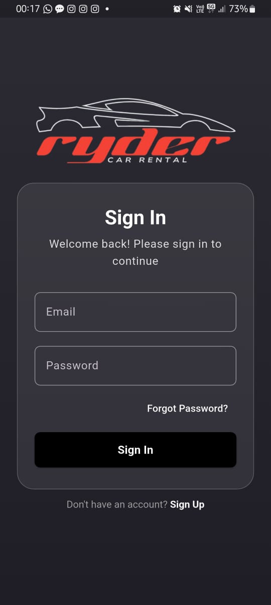

<h1 align="center" id="title">Ryder - Car Rental Made Easy</h1>


## Screenshots

| Car List Screen                      | Car Details Screen                | Booking Screen                  | Map Screen                     |
|--------------------------------------|-----------------------------------|--------------------------------|--------------------------------|
|  |  |  |  |

| Onboarding Screen                    | Sign In Screen                    | Profile Screen                   | About Screen                   |
|--------------------------------------|-----------------------------------|----------------------------------|--------------------------------|
|  |  |  |  |


## Features

- **User Authentication**: Secure login and registration
- **Car Browsing**: View available cars with details and specifications
- **Interactive Maps**: Find cars near your location
- **Advanced Filtering**: Filter cars by brand, price, rating, and more
- **Detailed Car Information**: View car specifications, features, and pricing
- **Booking System**: Book cars for specific date ranges
- **Payment Integration**: Multiple Indian payment options (UPI, cards, wallets)
- **Booking Management**: View, modify, and cancel bookings
- **Receipt Generation**: Download booking receipts

## Tech Stack

- **Frontend**: Flutter
- **State Management**: BLoC pattern
- **Backend**: Firebase
- **Authentication**: Firebase Auth
- **Database**: Cloud Firestore
- **Maps Integration**: Flutter Maps and Open Street Map
- **Payment Processing**: Mock implementation (ready for integration)

## Getting Started

### Prerequisites

- Flutter SDK (2.5.0 or higher)
- Dart SDK (2.14.0 or higher)
- Android Studio / VS Code
- Firebase account

### Installation

1. Clone the repository
   ```
   git clone https://github.com/nikkhilpareek/ryder.git
   ```

2. Navigate to the project directory
   ```
   cd ryder
   ```

3. Install dependencies
   ```
   flutter pub get
   ```

4. Configure Firebase
   - Create a new Firebase project
   - Add Android/iOS apps to your Firebase project
   - Download and add the `google-services.json` (Android) or `GoogleService-Info.plist` (iOS) to your project
   - Enable Firebase Authentication and Firestore

5. Run the app
   ```
   flutter run
   ```

## Project Structure

```
lib/
├── data/
│   ├── models/       # Data models
│   └── repositories/ # Data sources and repositories
├── domain/
│   ├── entities/     # Business entities
│   └── usecases/     # Business logic
├── presentation/
│   ├── bloc/         # BLoC state management
│   ├── pages/        # UI screens
│   └── widgets/      # Reusable UI components
├── firebase_options.dart
├── injection_container.dart  # Dependency injection
└── main.dart         # Entry point
```

## Usage

### Browsing Cars
1. Browse the available cars on the home screen
2. Use filters to narrow down your search
3. View car details by tapping on a car card

### Booking a Car
1. Select a car and tap "Book Now"
2. Choose your rental dates
3. Fill in your personal information
4. Select payment method and additional options
5. Confirm your booking
6. Download your receipt

### Using the Map
1. Navigate to the map screen
2. View available cars near your location
3. Tap on car markers to view details
4. Book directly from the map interface

## Contributing

1. Fork the repository
2. Create your feature branch (`git checkout -b feature/amazing-feature`)
3. Commit your changes (`git commit -m 'Add some amazing feature'`)
4. Push to the branch (`git push origin feature/amazing-feature`)
5. Open a Pull Request

## License

This project is licensed under the MIT License - see the LICENSE file for details.

## Acknowledgments

- [Flutter](https://flutter.dev/)
- [Firebase](https://firebase.google.com/)
- [flutter_map](https://github.com/fleaflet/flutter_map)
- [flutter_bloc](https://github.com/felangel/bloc)
- All car images and icons used are property of their respective owners

## Contact

Nikhil Pareek - [Instagram](https://instagram.com/nikkhil.pareek)
Email - nikhilpareekopandit@gmail.com

Project Link: [https://github.com/nikkhilpareek/ryder](https://github.com/nikkhilpareek/ryder)
